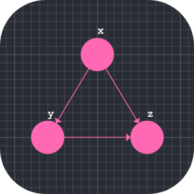
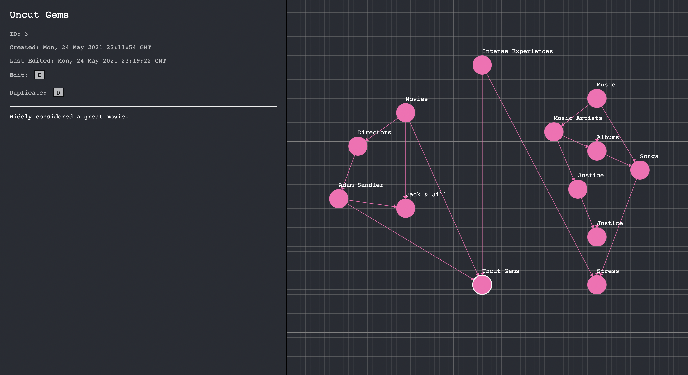

<p align="center"></p>

# AMDAG - Abstract Memory Directed Acyclic Graph

A far too nerdy approach to note taking.

## Motivation

AMDAG is a little project I put together to help me collect my thoughts better. In most note taking software and in physical journals, notes are written linearly where each note lies in a sequence. This works well for chronological note taking, but for anything else notes quickly get disorganised. Tagging systems alleviate this but aren't nice to visualise and quickly become cumbersome.

AMDAG aims to solve this by representing notes as a network, where an arrow from one note to another means the first note is on a topic more abstract than the second. The screenshot below gives an example of some notes on disparate topics which turn out to have connections to one another.



## Setup

After pulling this repo it's quite simple to get going. Open one terminal and run the following line:

```
npm run start-api
```

Then open a second terminal and run the following:

```
npm start
```

## Bonus Setup

If at some later date you wish to create a new database you'll need open `api.py` and replace the lines handling `SQLALCHEMY_DATABASE_URI` with the one below:

```python
app.config['SQLALCHEMY_DATABASE_URI'] = 'sqlite:///new_db_name.db'
```

Next go to the `api` folder and open up a python terminal and run the following lines:

```python
from api import *
db.create_all()
```

Your fresh database `new_db_name.db` should be finished and ready to use! If you create one called `private.db` this should be ignored by git and automatically get picked up before `amdag.db`.

## Technical details

The frontend is built using React, the central splitting comes from Split.js and the low level SVG interactions are handled using visx. Everything else was hand made, half as this project had specific needs and half in order to get practice. The backend is Flask/SQLite (I'd like to change this to Neo4j once I'm sure it'll run on my M1 Macbook).